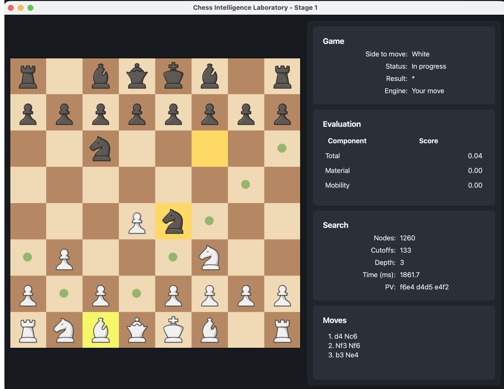

# Chess Intelligence Laboratory

A chess application built from scratch in Python, featuring a headless chess engine for standard chess rules, fixed-depth Minimax search with optional Alpha-Beta pruning, configurable component-based evaluation, structured telemetry, JSONL/CSV/PGN export, and a PySide6 graphical interface for human-vs-computer gameplay.

The engine is validated through unit, integration, perft, and test-only `python-chess` oracle tests covering representative legal-move, special-rule, position-transition, status, SAN, and PGN cases.

The project is designed around a strict separation between the chess engine and the user interface. The engine can be used independently for testing, search, FEN-based position analysis, logging, and future experimentation, while the PySide6 GUI acts only as a client of the engine.




---

## Features

### Complete chess rules

The engine implements and tests the following standard chess rules and position features:

- Legal move generation for all piece types.
- Check detection and king-safety validation.
- Checkmate and stalemate detection.
- Kingside and queenside castling.
- En passant generation, legality checking, execution, and reversal.
- Pawn promotion to queen, rook, bishop, or knight.
- Repetition-aware position tracking for game-state handling.
- Halfmove-clock tracking and draw-rule handling.
- FEN parsing and serialization.
- Minimal PGN export using Standard Algebraic Notation (SAN).

### Search

The engine uses a deterministic, fixed-depth adversarial search implementation:

- Minimax search.
- Alpha-Beta pruning.
- Deterministic move ordering.
- Capture-first move ordering.
- Principal variation tracking.
- Terminal-state scoring for checkmate and draws.
- Structured search result objects.
- Search statistics including nodes, cutoffs, reached depth, elapsed time, and principal variation.

### Explainable evaluation

The handcrafted evaluation function returns both a total score and a component-level breakdown.

Evaluation components include:

- Material balance.
- Mobility.
- King safety.
- Pawn structure.
- Center control.
- Piece activity.

Evaluation weights can be supplied through `SearchConfig`, allowing different scoring profiles to be tested during search without changing the evaluator implementation.

### Telemetry and export

The project records engine decisions in structured, machine-readable formats:

- Per-move evaluation and search telemetry.
- JSON Lines (`.jsonl`) export for detailed logs.
- CSV export for flat analysis-friendly summaries.
- Game history with moves, evaluations, and search statistics.
- Minimal PGN export with standard metadata tags and SAN movetext.
- Engine version and configuration metadata in logs.

### Desktop interface

The PySide6 GUI provides a human-vs-computer chess experience:

- Standard 2D board rendering.
- Piece selection and legal-move highlighting.
- Human move input through click-select/click-destination interaction.
- Promotion-selection dialog.
- Background engine search using a Qt worker thread.
- Signal/slot communication between worker and UI.
- Responsive interface while the engine searches.
- Evaluation breakdown display.
- Search statistics display.
- Principal variation display.
- Game status and move-history display.

---

## Architecture

The project uses a headless-engine-first architecture.

```text
PySide6 GUI / CLI / Tests / Export Scripts

Game Controller and Services

Rules Engine / Search / Evaluation / Telemetry

Position / Board / Move / Make-Unmake / FEN State
```

The GUI does not own chess rules or decide whether a move is legal. Instead, it requests legal moves and game-state updates from the engine. This separation keeps the chess logic independently testable and makes the engine reusable outside the desktop application.

### Core design principles

- **Single canonical position state:** `Position` stores the complete game state required to reproduce a chess position.
- **Typed domain objects:** pieces, moves, colors, castling rights, search results, evaluation results, and telemetry are represented by explicit structured models.
- **Mutable search position:** search uses make/unmake move operations instead of copying full board state at every tree node.
- **Deterministic search:** the same position, configuration, and evaluator produce the same result.
- **Structured outputs:** search and game data are exposed in logging-friendly objects before being written to JSONL, CSV, or PGN.
- **Test-first correctness:** rule behavior is tested with targeted FEN positions, perft, and a test-only python-chess oracle suite.

---

## Technology stack

| Area | Technology |
|---|---|
| Language | Python 3.11+ |
| Desktop GUI | PySide6 / Qt for Python |
| Testing | pytest |
| Linting and formatting | Ruff |
| Static type checking | mypy |
| Packaging | `pyproject.toml` with a `src/` package layout |
| Serialization | FEN, SAN, PGN, JSONL, CSV |
| Oracle validation | python-chess, test-only |
| Version control | Git |

---

## Installation

### Prerequisites

- Python 3.11 or newer.
- `pip`, `uv`, Poetry, or another Python environment manager.
- A desktop environment capable of running Qt applications.

### Create and activate an environment

Using the standard library virtual environment tool:

```bash
python -m venv .venv
```

macOS/Linux:

```bash
source .venv/bin/activate
```

Windows PowerShell:

```powershell
.venv\Scripts\Activate.ps1
```

### Install the project

Install the package in editable mode with development dependencies:

```bash
pip install -e ".[dev]"
```

This installs the application dependencies together with test, lint, type-checking, and oracle-testing tools.

---

## Running the application

Launch the desktop GUI:

```bash
chesslab-gui
```

If the package exposes the corresponding module entry point, the GUI can also be launched with:

```bash
python -m chesslab.gui.app
```

If a CLI console script is configured in `pyproject.toml`, inspect the `[project.scripts]` section for its exact command name.

The GUI starts a human-versus-engine game. In the default configuration, the human plays White through click-select/click-destination board interaction, and the engine searches and replies as Black in a background Qt worker thread.

---

## Development commands

Run the complete test suite:

```bash
python -m pytest
```

Run the test-only python-chess oracle suite:

```bash
python -m pytest tests/oracles
```

Run a focused test module or directory:

```bash
python -m pytest path/to/test_module.py
```

Run tests matching a keyword expression:

```bash
python -m pytest -k "perft"
```

Run Ruff linting:

```bash
ruff check .
```

Apply Ruff formatting:

```bash
ruff format .
```

Run static type checking:

```bash
mypy src
```

A typical pre-commit validation sequence is:

```bash
ruff format .
ruff check .
mypy src
python -m pytest
```

---

## Engine usage

### Parse a FEN position

```python
from chesslab.io.fen import parse_fen

position = parse_fen(
    "r1bqkbnr/pppp1ppp/2n5/4p3/3P4/5N2/PPP1PPPP/RNBQKB1R b KQkq - 1 3"
)

print(position.to_fen())
```

### Generate legal moves

```python
from chesslab.engine.legal_moves import generate_legal_moves

moves = generate_legal_moves(position)

for move in moves:
    print(move)
```

### Search a position

```python
from chesslab.engine.search.config import SearchConfig
from chesslab.engine.search.engine_search import search_position


config = SearchConfig(depth=3, use_alpha_beta=True)
result = search_position(position, config)


print("Best move:", result.best_move)
print("Score:", result.evaluation.total)
print("Nodes:", result.stats.nodes)
print("Cutoffs:", result.stats.cutoffs)
print("Depth:", result.stats.depth_reached)
print("Time (ms):", result.stats.time_ms)
print("PV:", result.stats.principal_variation)
```

### Inspect evaluation components

```python
from chesslab.engine.eval.evaluator import evaluate


evaluation = evaluate(position)

print("Total:", evaluation.total)
print("Material:", evaluation.material)
print("Mobility:", evaluation.mobility)
print("King safety:", evaluation.king_safety)
print("Pawn structure:", evaluation.pawn_structure)
print("Center control:", evaluation.center_control)
print("Piece activity:", evaluation.piece_activity)
print("Piece activity:", evaluation.piece_activity)
```

---

## Evaluation model

The evaluator computes a weighted sum of component scores.

$$
E(P) =
w_m M(P) +
w_{mob} Mob(P) +
w_k K(P) +
w_p P_s(P) +
w_c C(P) +
w_a A(P)
$$

Where:

- $M(P)$: material balance.
- $Mob(P)$: mobility difference.
- $K(P)$: king-safety score.
- $P_s(P)$: pawn-structure score.
- $C(P)$: center-control score.
- $A(P)$: piece-activity score.
- $w$: configurable component weights.

The engine returns both the final score and the individual contributions. This makes each evaluation easier to inspect, test, log, and display in the GUI.

---

## Search model

The engine searches legal moves using fixed-depth Minimax with optional Alpha-Beta pruning.

```text
Position
   |
   v
Generate legal moves
   |
   v
Order moves deterministically
   |
   v
Make move
   |
   v
Recurse with Minimax / Alpha-Beta
   |
   v
Unmake move
   |
   v
Return best move, score, PV, and statistics
```

The search result includes:

- best move,
- score,
- principal variation,
- searched nodes,
- alpha-beta cutoffs,
- reached depth,
- elapsed search time,
- an evaluation result with a total score and component-level breakdown.

---

## Rules and correctness validation

The engine is tested using several complementary strategies.

### Unit and integration tests

The test suite covers:

- FEN parsing and serialization.
- Square indexing.
- Piece movement.
- Pseudo-legal move generation.
- Legal move generation.
- Checks, pins, checkmate, and stalemate.
- Castling rules and castling state restoration.
- En passant rules and resulting king safety.
- Promotion and underpromotion.
- Threefold repetition.
- 50-move-rule detection.
- Search correctness and determinism.
- Evaluation component behavior.
- Telemetry, JSONL, CSV, SAN, and PGN export.
- GUI interaction and worker-thread contracts.

### Perft validation

`perft(position, depth)` is used to validate legal move generation and make/unmake behavior by counting legal leaf nodes at a specified depth.

The engine also provides `divide(position, depth)` so a perft total can be broken down by root move. This makes it easier to isolate rule bugs involving castling, en passant, promotions, or state restoration.

### python-chess oracle tests

The project uses `python-chess` as a development and test-only oracle. It is not used by the production engine, search, or GUI.

Oracle tests compare the custom engine against python-chess for:

- legal move sets normalized to UCI notation,
- FEN parsing and resulting position state,
- castling availability and execution,
- en passant generation and legality,
- promotion and underpromotion,
- make/unmake resulting FEN parity,
- check, checkmate, and stalemate status,
- selected SAN and PGN cases.

This provides independent validation while preserving the project’s from-scratch engine implementation.

---

## Logging and exports

The application can emit structured information at multiple levels.

### Per-move telemetry

Each recorded engine decision is exported as one structured JSON object. The exact field names are defined by the telemetry schema and include the position FEN, selected move, score, evaluation breakdown, search statistics, search configuration, engine version, schema version, and timestamp.

### Export formats

- **JSONL:** detailed append-friendly per-move records.
- **CSV:** flattened summaries suitable for spreadsheets and quick analysis.
- **PGN:** shareable game records with metadata and SAN movetext.

Export destinations are selected by the caller. A convenient local development convention is to organize generated files under an `output/` directory, for example:

```text
output/
├── csv/
├── jsonl/
└── pgn/
```

---

## Author

```text
Name: Kanad Saswade
GitHub: https://github.com/kcsaswade
```